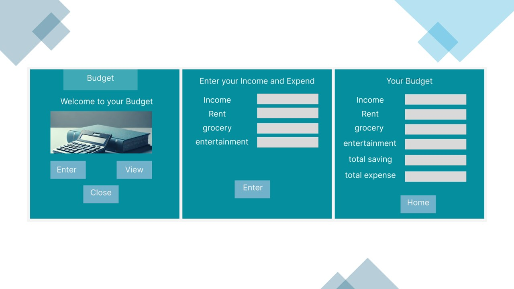

# Monthly Budget App

The Monthly Budget App is an intuitive finance management tool built with Python and Tkinter, designed to help users track and manage their personal finances efficiently. This application allows users to input various sources of income and monthly expenses including rent, groceries, utilities, and entertainment, plus it offers the flexibility to add miscellaneous expenses. The final output displays a detailed summary of total expenditures and savings, providing a clear picture of financial health.

## Features

- **Income Tracking**: Input multiple sources of income to see your total earnings.
- **Expense Management**: Categorically log expenses such as rent, groceries, entertainment, and utilities.
- **Add Custom Expenses**: Flexibility to add any out-of-the-ordinary expenses.
- **Financial Summary**: View a detailed breakdown of your expenses and savings to understand your financial standing.
- **Interactive UI**: A straightforward and engaging user interface designed in Figma, ensuring ease of use for all user levels.

## Video Demonstration
Watch a quick demonstration of how the Monthly Budget App works:
https://drive.google.com/file/d/1b3tpqsZs9XfOTr2MxNB1n9mDxj2SHwLd/view?usp=drive_link 

## Figma Design

